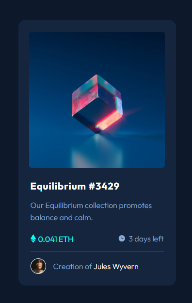

# Frontend Mentor - NFT preview card component solution

This is a solution to the [NFT preview card component challenge on Frontend Mentor](https://www.frontendmentor.io/challenges/nft-preview-card-component-SbdUL_w0U). Frontend Mentor challenges help you improve your coding skills by building realistic projects. 

## Table of contents

  - [The challenge](#the-challenge)
  - [Screenshot](#screenshot)
  - [Links](#links)
  - [Built with](#built-with)
  - [Continued development](#continued-development)
  - [Author](#author)

### The challenge

Users should be able to:

- View the optimal layout depending on their device's screen size
- See hover states for interactive elements

### Screenshot

### Links

- Live Site URL: [https://klara367.github.io/NFT-preview-card-component/](https://klara367.github.io/NFT-preview-card-component/)

### Built with

- Semantic HTML5 markup
- CSS custom properties
- Flexbox

### Continued development

Focusing on responsive web design and mobile first approach.

## Author

- Frontend Mentor - [@klara367](https://www.frontendmentor.io/profile/klara367)
